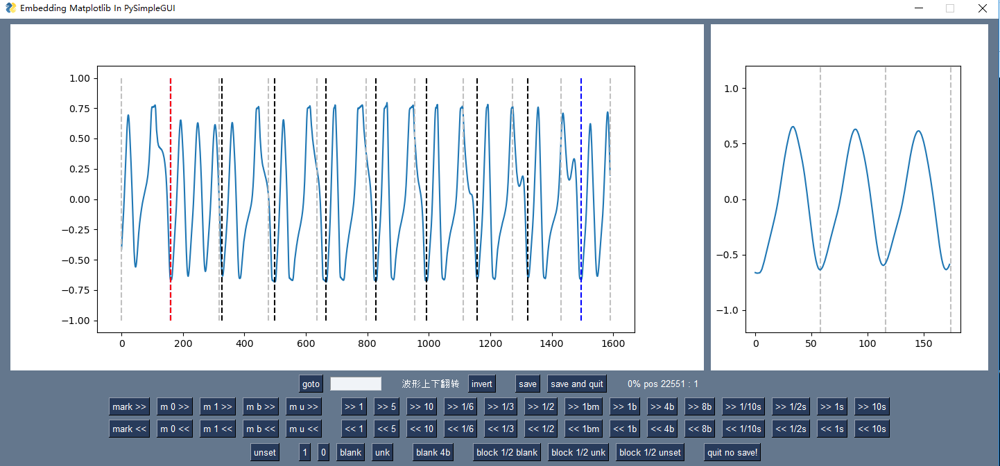

# wav2vz

LASER310 VZ200 cassette wav file to .VZ file

2023-05-30

这是一个 LASER310 的wav数据录音文件转vz格式的工具。
该转换程序使用的是神经网络识别技术（属于时间序列分类问题 Time Series Classifier），类似于验证码识别，具有灵活的可塑性。
只要不是数据丢失，基本能把音频文件正确的识别出来，虽然速度很慢。

该工具包主要包括以下几个工具。

1.wav2vz_torch_SiLU.py 或 wav2vz_torch_ReLU.py
数据录音文件转vz格式程序文件。
待转换录音文件存放在wav_files_split目录中，转换结果存放在vz_files目录中。
需要注意的几点，a.待转换的音频文件必须预先分割，该转换程序只能处理单一程序的音频文件。
b.转换程序用到 PyTorch 神经网络框架，请先安装 pytorch 库。
c.由于录音文件特征差距较大，对于不能识别的录音，可以通过wav2train_data.py编辑特征样本，
通过train.py训练神经网络后再识别。

2.wav_split.py
把多个程序的音频文件分割为单一程序的音频文件。
原始的音频文件放在 wav_files 目录中，分割结果存放在wav_files_split目录中。
程序计算音频的均方根（RMS）值来分割音频文件。TH 阈值。低于TH，认为是静音。可以在程序中修改TH值。

3.wav2train_data.py "filename.wav"
编辑特征样本
目录train_data下存放着音频特征训练数据。
jsonl 文件是特征标识文件，用途是选取长度 600us 左右音频，标识分为 不能识别unk 空白blk 数据0 数据1 等4种。
通过train.py把特征提取出来，生成权重文件tsc.pth供识别程序使用。

4.train_SiLU.py 或 train_ReLU.py
神经网络训练程序
把特征提取出来，生成权重文件tsc_SiLU.pth或tsc_ReLU.pth供识别程序使用。

5.vz2bas.py
vz文件转bas文件。待转换文件放在vz_files目录中，转换结果存放在bas_files目录中。
开发过程中用于辅助验证识别的数据。框架已经搭好，转换细节未完成。

如果碰到难以识别的录音文件，也可以交给作者代为转换。

